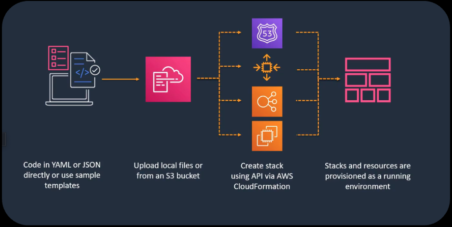

# 🌐 Simple Webpage Hosting on AWS using CloudFormation

This project demonstrates how to deploy a basic webpage hosting environment using **AWS CloudFormation**. It provisions an **EC2 instance**, assigns it an **Elastic IP**, and secures it using a custom **Security Group** — all defined in an **Infrastructure as Code (IaC)** YAML template.

---

## 🚀 Features

- ✅ **Elastic IP** for static public access
- ✅ **Custom Security Group** allowing HTTP/SSH access
- ✅ **Amazon Linux EC2 instance** to host a basic webpage
- ✅ Fully automated provisioning using AWS CloudFormation

---

## 🧱 Architecture

---

## 🛠️ Tech Stack

| Category         | Tool                |
|------------------|---------------------|
| Cloud Provider    | AWS                 |
| IaC Tool          | AWS CloudFormation  |
| Language          | YAML                |
| Instance OS       | Amazon Linux 2      |
| Hosted Content    | Static HTML Webpage |

---

## ⚙️ CloudFormation Highlights

- **Infrastructure as Code (IaC)**: Automates creation, management, and updates of AWS infrastructure.
- **Declarative Language**: Defines desired end states, and CloudFormation handles provisioning.
- **Template-Based**: Uses a clean, structured YAML file.
- **AWS Native**: Fully integrated with AWS services — no external tooling needed.

---

## 📝 How to Deploy

1. **Login to AWS Console**
2. Go to **CloudFormation > Stacks > Create Stack (With new resources)**
3. Upload or paste the CloudFormation YAML template
4. Follow the prompts and click **Create Stack**
5. After deployment, the EC2 instance will be publicly accessible via the **Elastic IP**

---

## 📁 Files

- `ec2-create.yml` – CloudFormation template
- `ec2-sg.yml` – CloudFormation template
- `README.md` – Project documentation

---

## 🧑‍💻 Author

**Abu Mohammad Tariqul Ismail**  
[www.tariqulismail.com](https://www.tariqulismail.com)
