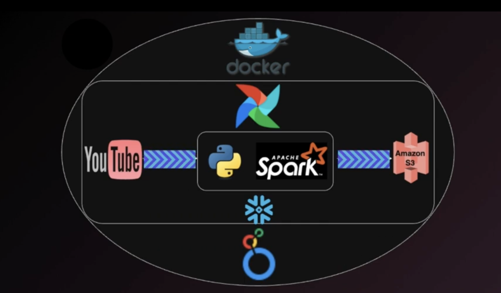
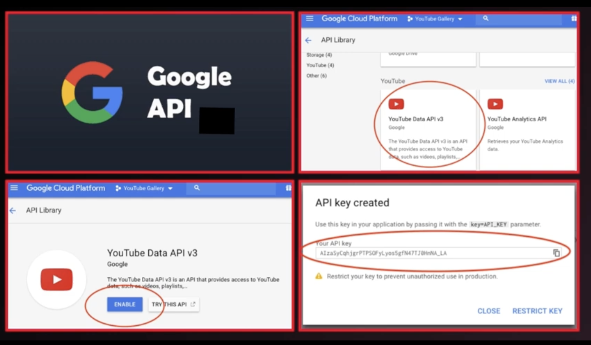
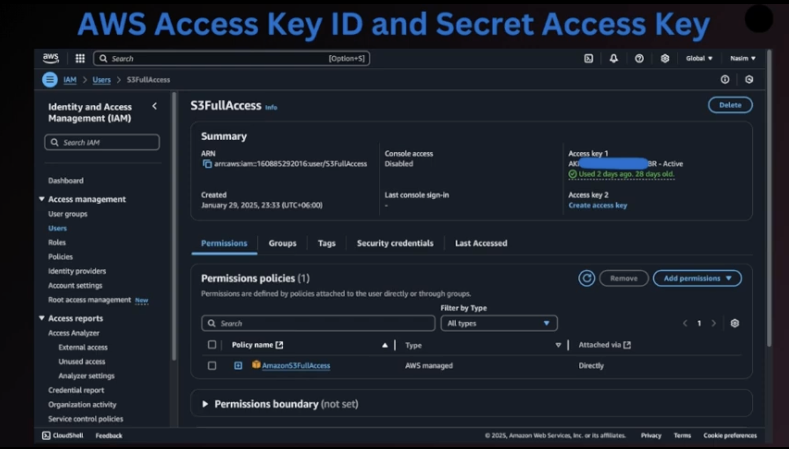

# End-to-End ETL Pipeline with Python, Airflow, Spark, Docker, S3, Snowflake & Google Looker Studio

## Introduction
Welcome to this project on building an end-to-end ETL pipeline using Python, Apache Airflow, Spark, Docker, S3, Snowflake, and Google Looker Studio.
In this project, I’ll walk you through the complete process of extracting, transforming, and
visualizing data from YouTube API, all automated with Apache Airflow and deployed in a
Dockerized environment.

## Architecture

## step 1: Obtain a Youtube Data API Key

- Visit the Google Developers Console.
- Create a new project.
- Search for the “YouTube Data API” and enable it.
- Generate new credentials and copy the API key for later use in the project.

  

## step 2: Acquire AWS Access Key ID and Secret Access Key

- Log in to your [AWS Management Console](https://aws.amazon.com/console/).
- Navigate to the IAM (Identity and Access Management) section and create a new user.
- Attach the necessary policies for S3 access and create Access Keys.
- Save the generated Access Key ID and Secret Access Key securely for use in the project.

## step 3: Using VS code Create a Docker Image

- Create a new folder for your project and name it as “Airflow-Project”
- All code share in below project

 [Airflow-Project](Airflow-Project)
