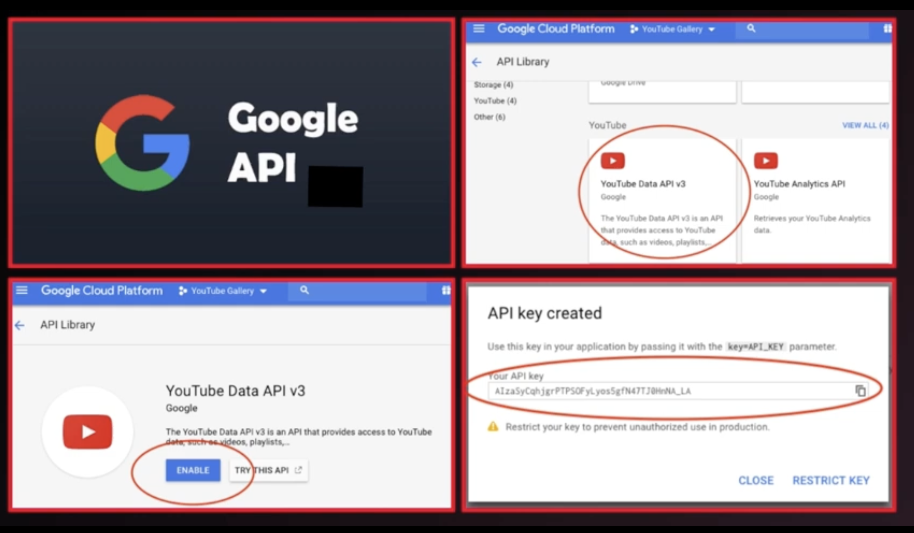
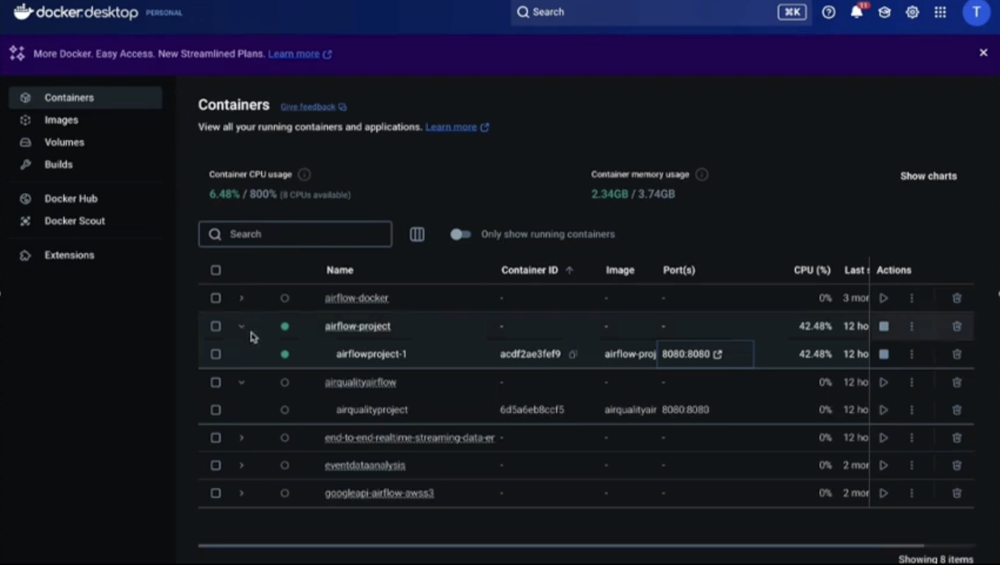
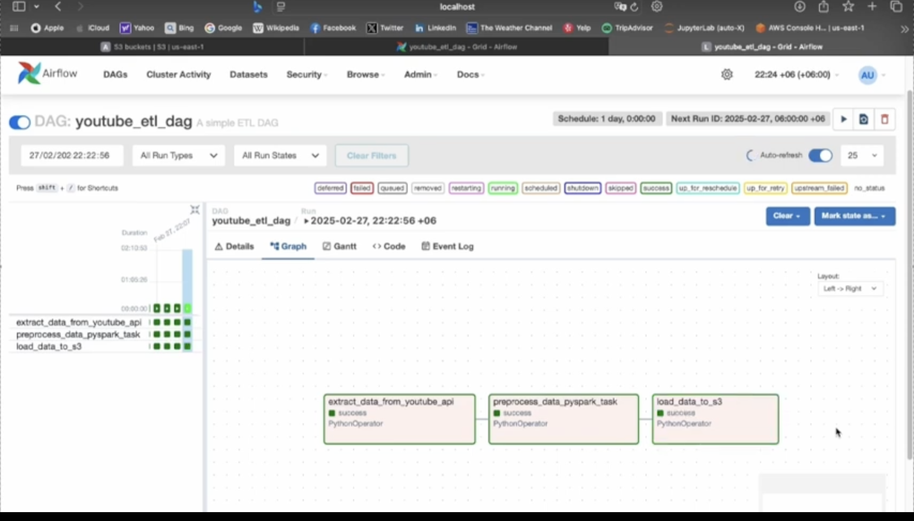
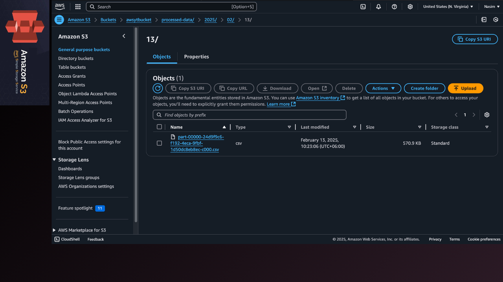
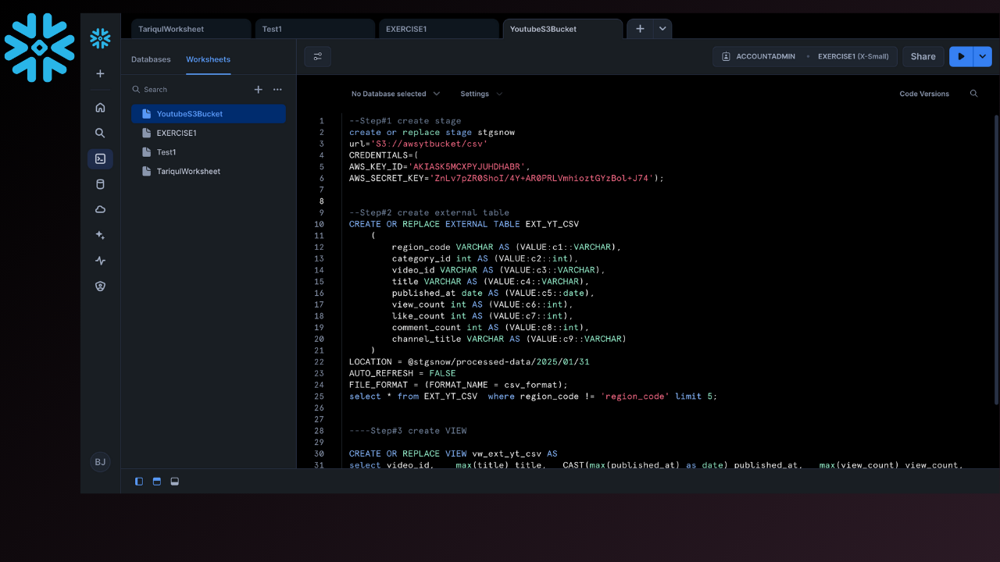
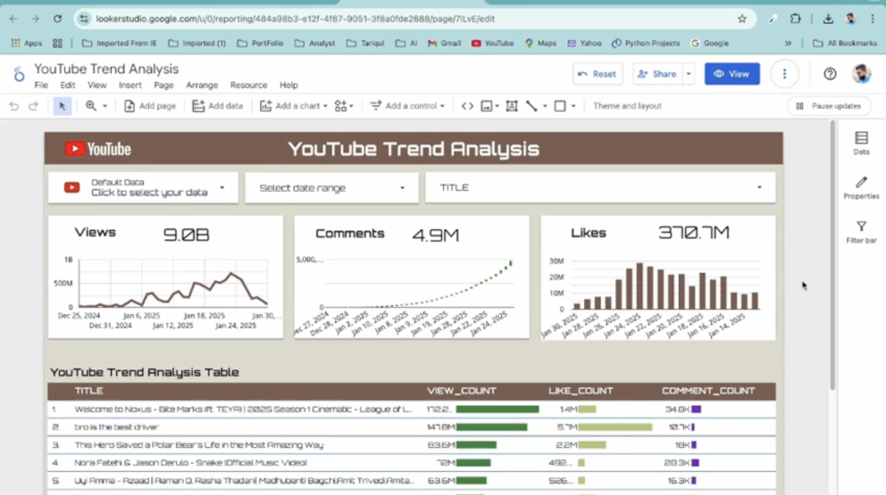
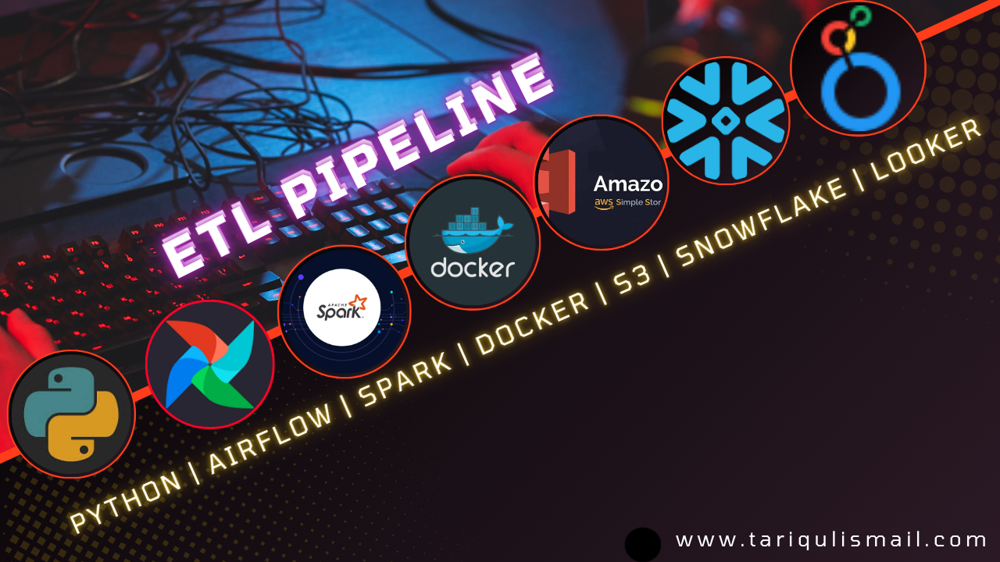

# End-to-End ETL Pipeline with Python, Airflow, Spark, Docker, S3, Snowflake & Google Looker Studio

## Introduction
Welcome to this project on building an end-to-end ETL pipeline using Python, Apache Airflow, Spark, Docker, S3, Snowflake, and Google Looker Studio.
In this project, I’ll walk you through the complete process of extracting, transforming, and
visualizing data from YouTube API, all automated with Apache Airflow and deployed in a
Dockerized environment.

This project delivers a fully automated, scalable, and high-performance ETL pipeline that integrates cutting-edge data engineering technologies to streamline data extraction, transformation, storage, and visualization. Unlike traditional ETL solutions, this pipeline leverages Apache Airflow for orchestration, Apache Spark for big data processing, Docker for containerization, and Snowflake for optimized storage, ensuring seamless data flow with minimal latency.

What sets this project apart is its real-time analytics capability, allowing businesses to make data-driven decisions faster. By integrating Google Looker Studio, we provide interactive dashboards that transform complex datasets into actionable insights. Whether for finance, e-commerce, or SaaS applications, this solution is designed for efficiency, scalability, and automation, eliminating manual data handling and optimizing cloud costs.

## Architecture

## step 1: Obtain a Youtube Data API Key

- Visit the Google Developers Console.
- Create a new project.
- Search for the “YouTube Data API” and enable it.
- Generate new credentials and copy the API key for later use in the project.

  

## step 2: Acquire AWS Access Key ID and Secret Access Key

- Log in to your [AWS Management Console](https://aws.amazon.com/console/).
- Navigate to the IAM (Identity and Access Management) section and create a new user.
- Attach the necessary policies for S3 access and create Access Keys.
- Save the generated Access Key ID and Secret Access Key securely for use in the project.

## step 3: Using VS code Create a Docker Image

- Create a new folder for your project and name it as “Airflow-Project”
- All code share in below project

 [Airflow-Project](Images/Airflow-Project)

The process starts with extracting trending video data from YouTube using the YouTube
API. This includes information like video titles, views, likes, comments, and categories.

## step 4: Run the docker

Run the compose up to run the docker.

## step 5: Open the Airflow DAG

Trigger the youtube_etl_dag and run the process

## Step 6: Open AWS s3 bucket

After run the DAG successfully the YouTube Data available in S3 bucket.

## Step 7: connect S3 to Snowflake database

Run the the query [Snowflake Query](Snowflake_Query.html) 
Anlaze the data for final visulasation.

## Step 8: Build the dashboard in Google looker studio

Connect the snowflake database to Google looker studio and create the dashboard.

With 15+ years of experience in data engineering, I specialize in building end-to-end pipelines that are secure, cost-effective, and enterprise-ready. This project is not just about data movement—it’s about empowering businesses with real-time intelligence and a future-proof data architecture.

### Watch the full video

