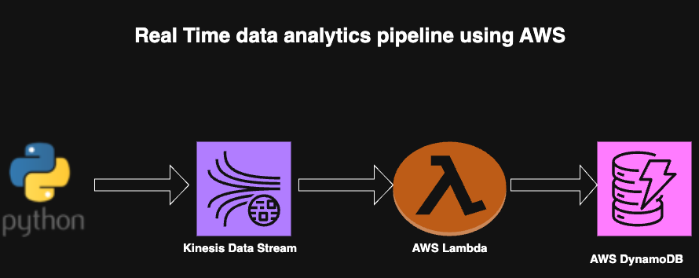

# Realtime Data Analytics Pipeline with Kinesis, Lambda, DynamoDB & Python

## Overview
This project demonstrates how to develop a real-time streaming data pipeline using **AWS services** and **Python**. The pipeline efficiently processes IoT, energy, and AI workflow data using event-driven architectures.


## Architecture



### **Technologies Used**
- **AWS Kinesis Data Streams** - For real-time data ingestion.
- **AWS Lambda** - For serverless data transformation.
- **AWS DynamoDB** - For scalable data storage.
- **AWS S3 & Redshift** - For optimized data retrieval and analytics.
- **Docker** - For containerized execution of Python scripts.
- **Python** - For data processing and ETL scripting.

## **Project Goals**
- 🚀 Build a real-time **data pipeline** for processing IoT, energy, and AI workflow data.
- 📊 Optimize **data storage & retrieval** using AWS DynamoDB, S3, and Redshift.
- 🔄 Implement **event-driven architectures** using AWS Kinesis.
- 🔧 Develop **ETL pipelines** to ingest, transform, and structure large energy datasets.

## **Architecture**
1. **Data Ingestion:** IoT and AI workflow data are ingested into **AWS Kinesis Data Streams**.
2. **Real-Time Processing:** AWS **Lambda** functions process and transform the data.
3. **Data Storage:** Processed data is stored in **DynamoDB** for quick lookups and in **S3/Redshift** for analytics.
4. **Analytics & Visualization:** AWS services like **Redshift** and **Athena** enable querying and reporting.

## **Setup Instructions**
### **1. Clone the Repository**
```sh
 git clone https://github.com/your-repo/realtime-data-analytics.git
 cd realtime-data-analytics
```

### **2. Configure AWS Credentials**
Ensure you have the AWS CLI configured:
```sh
 aws configure
```
Set up your `AWS_ACCESS_KEY_ID`, `AWS_SECRET_ACCESS_KEY`, and `AWS_REGION`.

### **3. Create Kinesis Stream**
```sh
aws kinesis create-stream --stream-name kinesis-stream-1 --shard-count 1
```

### **4. Deploy Lambda Function**
```sh
cd lambda/
zip function.zip lambda_function.py
aws lambda create-function --function-name ProcessKinesisData \
  --runtime python3.8 --role <IAM_ROLE_ARN> --handler lambda_function.lambda_handler \
  --zip-file fileb://function.zip --timeout 30
```

### **5. Connect Kinesis to Lambda**
```sh
aws lambda create-event-source-mapping --event-source-arn <Kinesis ARN> \
  --function-name ProcessKinesisData --starting-position LATEST
```

### **6. Store Data in DynamoDB**
Create a DynamoDB table:
```sh
aws dynamodb create-table --table-name SensorData \
  --attribute-definitions AttributeName=id,AttributeType=S \
  --key-schema AttributeName=id,KeyType=HASH \
  --provisioned-throughput ReadCapacityUnits=5,WriteCapacityUnits=5
```

### **7. Run Python Producer**
A sample producer script to send IoT data to Kinesis:
```sh
python producer.py
```

## **Future Enhancements**
✅ Add **real-time dashboards** using AWS QuickSight.  
✅ Improve **fault tolerance** with AWS SQS & SNS for notifications.  
✅ Implement **machine learning models** for anomaly detection in IoT data.  

## **Contributing**
Feel free to contribute by submitting **issues** or **pull requests**! 🚀

## **License**
This project is licensed under the MIT License - see the [LICENSE](LICENSE) file for details.
